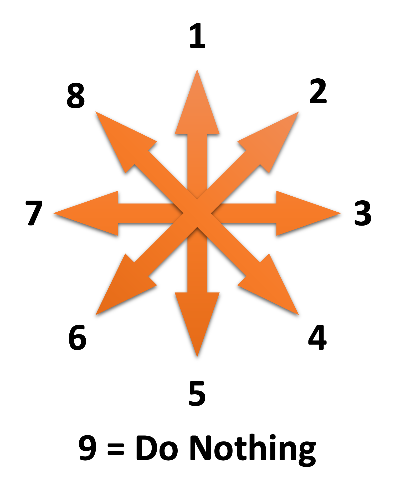
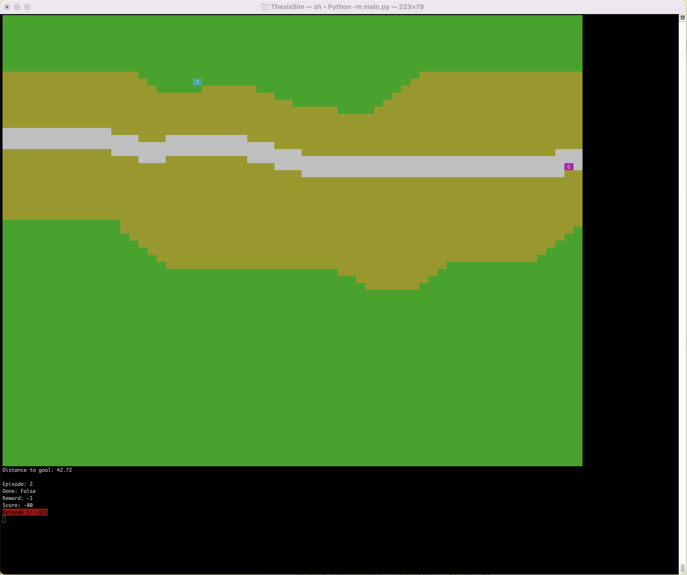

# MilVehicleSimEnv for Gym Handbook
**Latest edit:** 06/16/2022 
**Author:** Thomas Schiller 
**University:** University of Central Florida (UCF) 
**Institute:** Institute for Simulation and Training 

## Introduction
This is a custom single-agent gym environment simulating a tank or drone movement on a custom map of 64x64 size. 
The goal of the tank or drone is to capture the flag.

## Map and Scenario Selection
Maps and scenario files need to be set in the init-function:

	# set Map and Scenar File!
	map_file = "maps/Map01_TankSimEnv.csv"
	self.scenar_file = "scenars/Scenar05_TankSimEnv.csv"

## Map Files
Maps can be created with an Excel tool and are stored in a csv file. The tool and csv map files are stored in the "maps" folder. 
Each grid on the map is defined by the following code:

|Code   |Element    |
|-------|-----------|
|90     |Forrest    |
|91     |Sand       |
|92     |Road       |
|93     |Water      |

Map is loaded as list and can be accessed with `list_map[y][x]` in the TankSimEnv.py

### ShowMap Tool
This tool is to show a graphical map from a map csv file. It has a command line interface (CLI) and can be used in terminal or command line. 

Use the help command for how to use this tool:

	MapViewer --help
	
   The following commands are available:
    
	MapViewer showmap --filename  --> Show Map in Windows
	MapViewer savemap --filename  --> Saves Map as PNG-File

Standard --filename is "maps/Map01_TankSimEnv.csv".
    
## Scenario Files

Scenars can be created with an Excel tool and are stored in a csv file. The tool and csv scenar files are stored in the "scenars" folder. 
Each grid of the scenar is defined by the following code:

|Code   |Element    |
|-------|-----------|
|10     |Tank/Drone |
|99     |Goal/Flag  |
|0      |Nothing    |

Scenar is loaded as list and can be accessed with `list_map[y][x]` in the TankSimEnv.py

    
## Action Space

|Action|Movement        |
|------|----------------|
|1     |Move NORTH      |
|2     |Move NORTH-EAST |
|3     |Move EAST       |
|4     |Move SOUTH-EAST |
|5     |Move SOUTH      |
|6     |Move SOUTH-WEST |
|7     |Move WEST       |
|8     |Move NORTH-WEST |
|9     |Do nothing      |

    
## Observation Space
Combination of Map List and Scenar List; uses module merge_obspace 

The observation space includes:

* the terrain
* the entity (tank/drone)
* the goal (disabled at the moment)
* NOT the IED
* Direction from the goal (in reduced observation space only)
* Distance to the goal (in reduced observation space only)

### Full Observation Space
Size: 64 x 64
Note: Full observation is not quite functional at the moment. The goal is disable due to focus on the reduced observation space.

### Reduced Observation Space
A reduced observation space can be activated. This simulated a limited view of the entity.

The reduced observation space can be activated in the init-function:

	# set if observation space is reduced
	self.reduced_obspace = True

The following observation spaces are possible:

* 5 x 5
* 7 x 7

The size of the reduced observation space can be set in the `reduce_obspace.py`:

	#reduced_obspace_size = 9  # 3 x 3
	#reduced_obspace_size = 25  # 5 x 5
	reduced_obspace_size = 49  # 7 x 7

The reduced observation space includes the direction of the entity from the goal and distance of the entity to the goal.

* Direction from the goal:
	* 1 = North
	* 2 = East
	* 3 = South
	* 4 = West
* Distance to the goal:
	* Integer value from 0 to 6 (close to far)

### Observation Space Viewer
The `obspace_show.py` can be run in a separate terminal. This script grabs the observation space from the observation_space folder. It is needed to activate show_obspace in the `main.py` to use this:

	show_obspace = True
	
The observation space viewer is especially useful with the reduced observation space.

The reduced observation space needs to be set in the `obspace_show.py` according to the reduced observation space in the `reduce_obspace.py`:

	# set the reduced observation space
	reduced_obspace = True
	
	#reduced_obspace_size = 9  # 3 x 3
	#reduced_obspace_size = 25  # 5 x 5
	reduced_obspace_size = 49  # 7 x 7

 
 
Reduced observation space of 7 x 7 in the observation space viewer

## Reward
Worst Possible Reward: -121 (timesteps - 1)
Best Theoretical Reward: 0

The reward is similar to Mountain Car. The higher the value, the better the result.

## Drone Mode
A drone mode can be activated. This means, that the speed is always the same no matter what terrain. 
Drone mode activation and speed can be set in the init-function:

	# set Drone Mode
	self.drone_mode = True
	self.speed_drone = 1
	
## IED Mode
IED mode can be activated in the init-function:

	# set IED Mode
	self.ied_mode = True

An IED can be set wherever wanted in the scenario files. The code for an IED in the csv-file is `80`. Similar to the goal, every step is checked if the tank/drone is at a certain distance to the IED. When the distance is <= 2, the IED gets activated.

Rendering for the IED can be activated and deactivated in the init-function:

    # show IEDs to user in rendering
    self.show_ied = False
    
Although the IED can be rendered it never appears in the observation space for obvious reasons.
If the IED is activated, the episode is set to done and the worst possible reward is given.

 
The IED is rendered as a red "B".

A scenario with an IED included can also be used without IED mode activated. The IED will then not be taken in consideration in activation and rendering.

## Path Tracking
If Path tracking is true, each episode will write the path of the tank/drone to a csv-file 
Path tracking can be activated in the init-function:

    # set Path Tracking
    self.path_tracking = True

The csv-file as the format:

|x                    |y                    |
|---------------------|---------------------|
|x-coordinate 1. step |y-coordinate 1. step |
|x-coordinate 2. step |y-coordinate 2. step |
|x-coordinate n. step |y-coordinate n. step |
    
    
### Path Viewer Tool: Single Path
This tool displays a tracked path with the map and scenar. 
Map, scenar and path must be set at the beginning of the file:

	map_file = 'maps/Map01_TankSimEnv.csv'
	scenar_file = 'scenars/Scenar01_TankSimEnv.csv'
	path_file = 'path_tracking/Path_1654107091.868553.csv'
	
The tool will print the path from the path file:

### Path Viewer Tool: Multi Path
tbd