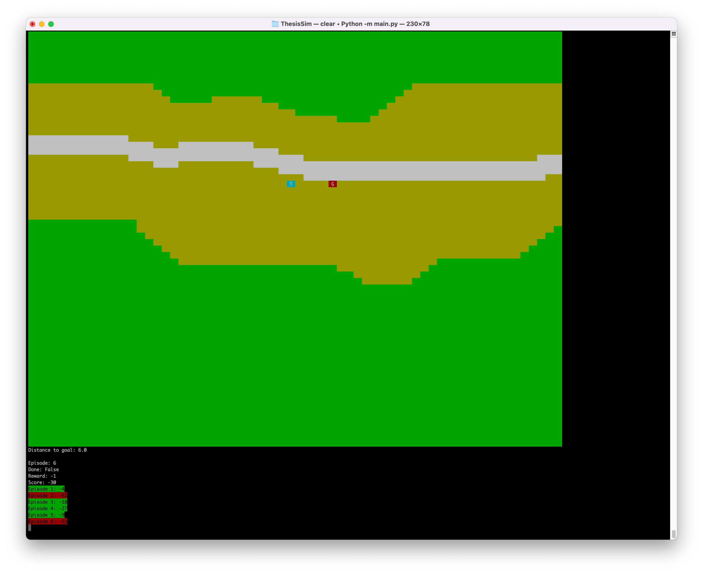

# MilVehicleSimEnv for Gym
**Latest edit:** 06/06/2022 
**Author:** Thomas Schiller 
**University:** University of Central Florida (UCF) 
**Institute:** Institute for Simulation and Training 

## What is this?
This is a custom single-agent gym environment simulating a tank or drone movement on a custom map of 64x64 size. 
The goal of the tank or drone is to capture the flag.

## Handbook
Please refer the handbook as the manual to this environment:
[MilVehicleSimEnv Handbook](Documentation/MilVehicelSimEnv_Handbook.md)